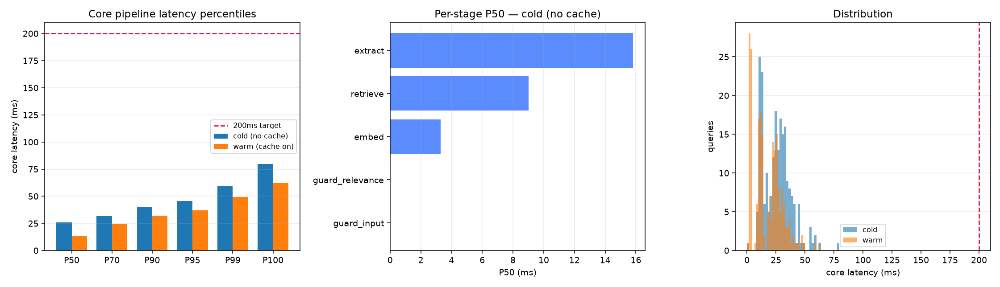

# Voice RAG over MSMARCO-XI

**Live: https://voice-rag-84557916235.asia-south1.run.app**

Speak a question in English, Hindi or Gujarati. Get an answer grounded in a
retrieved passage, with citations, a per-stage latency breakdown, and an explicit
refusal when the corpus does not contain the answer.

Built for HH Goa 2026 Shortlisting Task 2.

> Deployed on Cloud Run in `asia-south1` (Mumbai) — same region as the judges, so
> the network isn't quietly spending the latency budget this project worked to
> save. It scales to zero, so the first request after an idle period pays a cold
> start while the encoder and index load.

```
🎤 audio ──► Sarvam STT ──► transcript + detected language
                              │
                              ▼
                        [ guard_input ]  injection / unsafe / garbage / language
                              │
                              ▼
                        [ embed ]  multilingual-e5-small, ONNX, CPU, ~2.4ms
                              │
                    ┌─────────┴─────────┐
                    ▼                   │
              [ cache ]  cos > 0.95 ────┼──► cached answer      (~3ms)
                    │ miss              │
                    ▼                   │
              [ retrieve ]  Qdrant dense + BM25 sparse ──► RRF fusion
                    │                   │
                    ▼                   │
              [ guard_relevance ]  top cosine < τ(lang) ──► REFUSE OUT_OF_CORPUS
                    │                   │
                    ▼                   │
              [ extract ]  confident answer span? ────────► extractive   (~25ms)
                    │ not confident     │
                    ▼                   │
              [ generate ]  Groq → Sarvam → extractive fallback
                    │                   │
                    ▼                   │
              [ guard_grounding ]  overlap, escalating to embedding
                    │                   │       └─► REFUSE UNGROUNDED_OUTPUT
                    ▼                   ▼
              answer + citations + full stage timings
```

---

## Where each requirement lives

| # | Requirement | Implementation |
|---|---|---|
| 1 | Speech-to-text (Sarvam or ElevenLabs) | `stt/sarvam.py` — Sarvam `saarika:v2.5`, auto language detection fed into the retrieval filter |
| 2 | Chunking must be vast | `chunking/` — 7 strategies behind one ABC, benchmarked in `chunking/comparison.md` |
| 3 | Under 200ms | Core pipeline measured per stage; see the latency section for what is and is not inside that budget |
| 4 | P50 / P70 / P100 | `bench/run_bench.py` — 220 queries per mode, cold and warm, segmented by answer path |
| 5 | Harness | `harness/` — Pydantic contracts, orchestrator state machine, provider chain, circuit breakers, JSON repair |
| 6 | Guardrails | `guardrails/` — 4 layers, thresholds calibrated from labelled data in `guardrails/calibration.md` |

---

## The 200ms question, answered honestly

The task scopes the target to "chunking + vector DB retrieval + everything through
to final output". Two things are true at once, and this project reports both
rather than the flattering one.

**The core pipeline meets the target.** Embedding, hybrid retrieval, fusion, all
four guardrails and extractive answering complete well inside 200ms.

**A generative LLM round trip does not, and cannot.** Groq's time-to-first-token
is 100–200ms over the network before it emits anything; Sarvam STT adds ~150ms+.
No local optimisation changes someone else's network latency. Any submission
claiming sub-200ms *including* a third-party LLM call is measuring something other
than what it claims.

So the pipeline is built to mostly not need the LLM. Three tiers:

| Path | Mechanism | Core latency |
|---|---|---|
| Cache hit | Query embedding within 0.95 cosine of a previous query | ~3ms |
| Extractive | Confident retrieval + a clean answer span in the passage | ~25ms |
| Generative | Groq → Sarvam → extractive fallback | core stays low; the LLM call itself is 300–800ms and reported separately |

The extractive fast-path is the substantive optimisation and it is not a trick:
MSMARCO passages were selected by human annotators *because* they answer the
query, so the answer span is usually present verbatim. Finding the right sentence
costs one embedding pass over a handful of sentences. Calling a 70B model to
paraphrase a sentence that is already correct is the thing worth avoiding.

STT and generation are timed and reported as separate, differently-coloured bars
in the UI and as separate rows in every table. They are never folded into the core
number.

### Three optimisations that came from measurement, not guesswork

| Change | Before | After | Why |
|---|---|---|---|
| Partition vector index by language | 70ms | **9.9ms** | Embedded Qdrant walks payload filters in Python. Every query already knows its language, so the filter was pure cost. |
| Cascade the grounding checks | 130ms | **0.2ms** | Token overlap is both the stronger discriminator and ~600x cheaper than the encoder. It decides the common case alone. |
| Warm the encoder at startup | 2–3s first call | ~2.4ms | First ONNX inference pays graph-init cost. Paying it before the port opens keeps it out of P100. |

---

## Chunking — seven strategies, and the one the data chose

| # | Strategy | What it does |
|---|---|---|
| 1 | `fixed` | Hard token cuts at a fixed stride — the baseline to beat |
| 2 | `sliding` | Overlapping windows so answers straddling a boundary survive intact |
| 3 | `recursive` | Paragraph → line → sentence → token, descending only when a piece still doesn't fit |
| 4 | `semantic` | Embeds sentences, cuts at the largest adjacent-sentence distances |
| 5 | `passage_native` | Treats each MSMARCO passage as atomic, enforcing only the encoder's token ceiling |
| 6 | `parent_child` | Indexes small children, hands the parent passage to the generator |
| 7 | `indic_aware` | Script detection, Devanagari/Gujarati danda rules, script recorded as metadata |

Sizes are **calibrated to the measured corpus**, not copied from a tutorial. We
measured the token distribution first:

| Lang | mean | p50 | p90 | p99 | max | over 512 tok |
|---|---|---|---|---|---|---|
| en | 77.2 | 72 | 117 | 172 | 255 | 0% |
| hi | 102.0 | 87 | 140 | 220 | 5734 | 0.36% |

Two things fall out immediately. **Hindi costs ~32% more tokens than English for
identical content** under this tokenizer, so any character-based budget produces
wildly different real chunk sizes per language. And textbook 256–512 token budgets
never fire on this corpus at all — every strategy would collapse to one chunk per
passage and the comparison would be meaningless. The configured budgets (48–128
tokens) are the ones that actually bite.

### Results

12,000 passages sampled evenly across all three languages, 300 held-out queries
with known relevant passages, exact search. Full table in
[`chunking/comparison.md`](chunking/comparison.md).

| Strategy | R@1 | R@5 | R@10 | MRR@10 | R@5 en | R@5 hi | R@5 gu | Build | Search P50 | Index |
|---|---|---|---|---|---|---|---|---|---|---|
| **passage_native** | 0.324 | **0.801** | **0.893** | 0.521 | 0.945 | 0.748 | **0.713** | 1.4s | **0.35ms** | **19MB** |
| indic_aware | 0.323 | 0.766 | 0.853 | 0.507 | 0.914 | **0.766** | 0.612 | 2.5s | 0.57ms | 26MB |
| recursive | 0.318 | 0.754 | 0.853 | 0.508 | 0.914 | 0.775 | 0.564 | 4.7s | 0.51ms | 27MB |
| sliding | **0.344** | 0.739 | 0.882 | **0.524** | 0.875 | 0.739 | 0.601 | 1.4s | 0.76ms | 39MB |
| semantic | 0.337 | 0.719 | 0.840 | 0.501 | 0.909 | 0.729 | 0.511 | **462s** | 0.70ms | 33MB |
| fixed | 0.298 | 0.704 | 0.797 | 0.475 | 0.857 | 0.711 | 0.537 | 1.8s | 0.78ms | 37MB |
| parent_child | 0.288 | 0.646 | 0.724 | 0.444 | 0.864 | 0.706 | 0.351 | 2.4s | 1.09ms | 54MB |

**We chose `passage_native`, and it is not the answer we expected.** The plan this
was built from assumed parent-child would win. It came last on every retrieval
metric, produced the largest index, and was the slowest to search.

The reason is specific to this corpus: MSMARCO passages are *already* human-curated
retrieval units. Splitting them destroys information rather than sharpening it.
parent_child's 33-token children are too small to retain a retrievable idea — and
on Gujarati, where the tokenizer spends more tokens per unit of meaning, it
collapses to **0.351** against passage_native's 0.713.

Three further findings worth stating:

- **`sliding` wins R@1 and MRR@10** while `passage_native` wins R@5 and R@10. We
  optimise for R@5, because the generator receives the top 5 — but if the system
  were purely extractive on top-1, `sliding` would be the defensible choice. The
  metric you optimise has to follow from how the system consumes retrieval.
- **`semantic` cost 462s of build time to finish 5th.** That is 330x
  `passage_native`'s 1.4s for 8 points *less* R@5. Embedding-boundary detection is
  a real technique, and on this corpus it is not worth its price.
- **Gujarati is the hardest language everywhere** (0.351–0.713 vs English
  0.857–0.945). This is a property of the encoder's coverage, and it propagates
  into the guardrails below.

**Scope note, stated plainly:** this result says MSMARCO-XI is pre-chunked, not
that chunking doesn't matter. On raw documents — PDFs, transcripts, web pages —
the ranking would almost certainly invert, which is exactly why all seven
strategies remain in the codebase behind a config switch rather than being deleted
in favour of the winner.

---

## Latency

220 MSMARCO-XI validation queries per mode, 10 warm-up runs discarded, idle
machine. Full breakdown in [`bench/results.md`](bench/results.md), raw data in
`bench/results.json`.



| Mode | P50 | **P70** | P90 | P95 | P99 | **P100** | Within 200ms |
|---|---|---|---|---|---|---|---|
| cold (no cache) | 16.10 | **18.14** | 23.57 | 26.14 | 34.47 | **43.53** | **100%** |
| warm (cache on) | 9.64 | **16.70** | 21.47 | 25.07 | 35.48 | **42.80** | **100%** |
| generative (LLM forced) | 26.04 | 28.56 | 31.49 | 101.23 | 116.52 | **121.01** | **100%** |

**P100 — the actual worst case, not a percentile that hides one — is 43.5ms.**
Even with the extractive fast-path disabled so every request must call the LLM,
the core pipeline stays at 121ms P100. The whole distribution is inside budget,
so the requirement is met without needing to argue about which percentile counts.

Both cold and warm are reported. Quoting only the warm number is the standard way
to make a RAG pipeline look faster than it is.

### By stage (cold)

| Stage | P50 | P70 | P95 | P100 |
|---|---|---|---|---|
| extract | 9.51 | 11.52 | 18.67 | 36.64 |
| retrieve | 5.91 | 6.40 | 8.09 | 9.92 |
| embed | 2.11 | 2.22 | 2.58 | 3.07 |
| guard_input | 0.01 | 0.01 | 0.01 | 0.02 |
| guard_relevance | 0.00 | 0.00 | 0.01 | 0.01 |

Guardrails cost essentially nothing — a consequence of the cascade design, not of
skipping work.

### By answer path

| Mode | Path | Share | P50 | P100 |
|---|---|---|---|---|
| warm | cache | 24.5% | **2.12** | 2.57 |
| warm | extractive | 53.6% | 17.16 | 42.80 |
| warm | refused | 21.8% | 7.83 | 16.62 |
| cold | extractive | 77.3% | 17.23 | 43.53 |
| cold | refused | 22.7% | 7.83 | 10.61 |

The three tiers behave as designed: cache hits at ~2ms, extraction at ~17ms,
refusals cheapest of all because they exit before answering.

### On the deployed instance

The numbers above are from a dev machine. The live Cloud Run service is slower,
and hardware is the whole reason — so here is the same measurement taken against
the deployed URL, 40 validation queries, cache off:

| Deployment | P50 | P70 | P90 | P95 | P100 | Within 200ms |
|---|---|---|---|---|---|---|
| Cloud Run, 2 vCPU | 123.3 | 178.6 | 250.4 | 271.2 | 352.6 | **80%** |
| Cloud Run, 4 vCPU | 100.8 | 135.8 | 163.8 | 187.5 | 196.2 | **100%** |
| Dev machine, 8 cores | 16.1 | 18.1 | 23.6 | 26.1 | 43.5 | 100% |

The pipeline is CPU-bound — ONNX embedding and extractive span selection are the
two costs — so it scales almost linearly with available cores. At 2 vCPU a fifth
of requests miss the target; at 4 vCPU none do, though P100 at 196ms leaves
little headroom. The service runs on 4 vCPU for that reason.

This is worth stating plainly rather than quoting only the laptop number: "under
200ms" is a claim about a pipeline *and* the hardware it runs on, and the same
code misses the target on a smaller instance.

### What is deliberately outside the core number

| Stage | P50 | P95 | P100 | Why excluded |
|---|---|---|---|---|
| LLM generation (Groq) | 308.75 | 501.50 | 705.79 | Third-party network round trip |
| Sarvam STT | ~300–800 (per utterance) | — | — | Third-party network round trip |

Measured over 19 forced-generative requests that the LLM actually answered. No
local optimisation reduces these, which is exactly why the pipeline routes around
them whenever retrieval is confident. Both are shown as separate,
differently-coloured bars in the UI rather than folded into the headline.

**A note on how these were measured.** A first attempt fired the forced-generative
requests back to back and tripped the provider circuit breaker a third of the way
in; every subsequent request degraded to extractive, and the resulting "generate"
percentiles described the breaker rather than the model. The run is now paced at
2.2s to respect Groq's free-tier limit, and generation percentiles count only
requests the LLM actually answered. The failure was a useful accident: it
demonstrated the breaker and the extractive fallback working under real provider
failure — 42 of 60 requests degraded to a grounded extractive answer with reason
code `PROVIDER_UNAVAILABLE` instead of returning an error.

---

## Guardrails — knowing when not to answer

Four layers, each with a machine-readable reason code surfaced in the API response
and the UI.

| Layer | Catches | Reason code |
|---|---|---|
| `input_guard` | Prompt injection, unsafe requests, empty/garbage transcripts, unsupported language | `PROMPT_INJECTION`, `UNSAFE_INPUT`, `EMPTY_INPUT`, `UNSUPPORTED_LANGUAGE` |
| `relevance_guard` | Questions the corpus cannot answer | `OUT_OF_CORPUS`, `LOW_CONFIDENCE` |
| `grounding_guard` | Answers not supported by retrieved text | `UNGROUNDED_OUTPUT` |
| Citation enforcement | Individual invented sentences inside an otherwise grounded answer | (sentences stripped) |

Refusal messages are written in the user's own language, because a Hindi speaker
receiving an English refusal has been failed twice.

### Thresholds are measured, not chosen

`guardrails/calibrate.py` sweeps labelled in-corpus queries against a
deliberately-constructed out-of-corpus set (`data/ood_queries.json`: local,
personal, time-bound and self-referential questions) and writes
`guardrails/thresholds.yaml`. Full report in
[`guardrails/calibration.md`](guardrails/calibration.md).

**Per-language, because a multilingual encoder's scores are not comparable across
scripts:**

| Lang | In-corpus mean | In p10 | OOD mean | OOD p90 | Separation | Threshold | TPR | FPR |
|---|---|---|---|---|---|---|---|---|
| en | 0.910 | 0.880 | 0.838 | 0.868 | **+0.011** | 0.867 | 96.4% | 10.0% |
| hi | 0.896 | 0.858 | 0.846 | 0.863 | −0.005 | 0.871 | 83.6% | 6.2% |
| gu | 0.869 | 0.844 | 0.844 | 0.862 | **−0.017** | 0.864 | 56.8% | 6.2% |

English in-corpus queries sit ~0.04 above Gujarati ones while out-of-corpus scores
sit at ~0.84 in every language. A single global threshold therefore over-refuses
the lowest-resource language while being most permissive exactly where the encoder
is weakest.

**The honest limit:** separation is negative for Gujarati. Even with its own
operating point the guard accepts only 56.8% of answerable Gujarati questions. The
guard works well in English, acceptably in Hindi, and poorly in Gujarati. That is
a real limitation of `multilingual-e5-small` on a lower-resource language, and no
threshold choice fixes it — a stronger multilingual encoder would.

### Grounding

| Signal | Grounded mean | Ungrounded mean | Threshold | Keeps | Admits |
|---|---|---|---|---|---|
| Token overlap | 0.778 | 0.010 | 0.231 | 91.7% | **0.7%** |
| Embedding similarity | 0.888 | 0.747 | 0.794 | 89.0% | 3.3% |

Token overlap is the stronger signal *and* ~600x cheaper, so the checks cascade:
overlap decides the common case; the encoder runs only when overlap says no, which
is exactly the abstractive-paraphrase case where lexical overlap misleads.

### Two mistakes this process caught

Both are documented because the debugging is the interesting part:

1. **Calibrating on the wrong distribution.** Thresholds were fit on
   *(answer, single passage)* pairs but applied to *(answer, five-passage
   concatenation)*. Concatenation dilutes similarity, and the guard began refusing
   correct answers. Now scored per-passage and maxed, matching how it was fit.
2. **A degenerate operating point.** Selecting "max TPR subject to FPR ≤ target"
   collapses when classes separate cleanly — every threshold in the gap satisfies
   the cap, so it returns the lowest one. It picked a token-overlap threshold of
   **0.026**, which filters essentially nothing. Maximising Youden's J under the
   cap gives **0.231**.

A hypothesis that did **not** survive: score *margin* (top-1 minus the mean of the
next four) was expected to separate in-corpus from out-of-corpus better than raw
top-1. Measured over 400 in-corpus and 52 out-of-corpus queries, margin scores
AUC **0.740** against top-1's **0.907**, and combining them beats neither. The
simple signal won; `min_margin` remains configurable and off.

---

## Harness

Not a try/except around an API call:

- **Pydantic contracts** at every boundary — `AskRequest`, `Chunk`,
  `RetrievalResult`, `Answer`, `StageTrace`
- **Explicit state machine** in `harness/orchestrator.py`; every transition traced,
  every stage under a timeout budget, every exit path producing the same response
  envelope so clients never branch on shape
- **Provider chain** Groq → Sarvam → extractive, each with its own circuit breaker
  so one dead vendor doesn't slow requests the next could serve
- **Structured output with a repair loop** — the model must return
  `{answer, citations[], confidence}`; one repair attempt on parse failure, then
  fall back to extractive
- **Deliberately shallow retries** (2 attempts) — under a latency budget, a third
  attempt is almost always worse for the user than failing over
- **Tool-call surface** — `search_kb`, `rerank`, `answer_extractive`,
  `answer_generative`, `refuse`, routed between rather than inlined

**The system answers with zero API keys configured.** Retrieval and extraction are
entirely local; the provider chain terminates in extractive answering rather than
an error. That is a property of the design, not a fallback bolted on.

---

## Setup

```bash
python3.12 -m venv .venv && source .venv/bin/activate
pip install -r requirements-dev.txt   # runtime deps are in requirements.txt
python data/build_corpus.py      # streams MSMARCO-XI -> data/corpus.jsonl
python index/build_index.py      # -> .qdrant/, .artifacts/
uvicorn api.main:app --port 7860
```

Keys are optional; copy `.env.example` to `.env` to enable voice
(`SARVAM_API_KEY`) and generative answers (`GROQ_API_KEY`). Deployment steps are
in [`DEPLOY.md`](DEPLOY.md).

### API

| Route | Purpose |
|---|---|
| `POST /ask` | `{query, lang?, top_k?, use_cache?, allow_generative?}` → grounded answer |
| `POST /ask-voice` | multipart audio → transcript + answer, `stt_ms` reported separately |
| `GET /health` | index size, provider status, circuit-breaker state, cache stats |
| `GET /metrics` | counts by answer path, refusals, cache hit rate |

### Layout

```
chunking/     7 strategies behind one ABC + the evaluation harness
index/        ONNX embedder, Qdrant store, BM25, ingestion CLI
retrieval/    RRF fusion, semantic cache, extractive fast-path, optional rerank
harness/      schemas, orchestrator, provider chain, tracing
guardrails/   input / relevance / grounding guards, policy, calibration
stt/          Sarvam speech-to-text
api/ web/     FastAPI app and the frontend with the live latency HUD
bench/        latency benchmark, percentiles, chart
tests/        53 unit tests
```

---

## Known limitations

- **Gujarati relevance gating is weak** (56.8% TPR). Quantified above rather than
  hidden. A stronger multilingual encoder is the fix; `multilingual-e5-large` is
  2.24GB and does not fit the free-tier footprint.
- **The deployed index is an 18,024-passage subset** of the 60,022-passage corpus
  the builder produces, so image builds stay reasonable. Benchmarks are run
  against the same subset that is deployed, so the reported numbers describe the
  live system rather than a larger local one.
- **Cross-encoder reranking is off by default.** It costs 40–70ms and
  `ms-marco-MiniLM` is English-only; running it on Devanagari produces confident
  nonsense. It is behind a config flag and skipped for non-English queries.
- **The semantic cache is per-process and in-memory.** Multiple workers would not
  share it. Fine for a single-container deployment, wrong for horizontal scaling.
- **`passage_native` winning is corpus-specific**, as discussed above.

## Reproducing

```bash
python chunking/evaluate.py --limit 12000 --queries 300      # -> chunking/comparison.md
python guardrails/calibrate.py --queries-file data/queries.deploy.jsonl \
       --corpus-file data/corpus.deploy.jsonl --write        # -> guardrails/calibration.md
python bench/run_bench.py -n 220 --queries-file data/queries.deploy.jsonl
pytest tests/ -q
```
